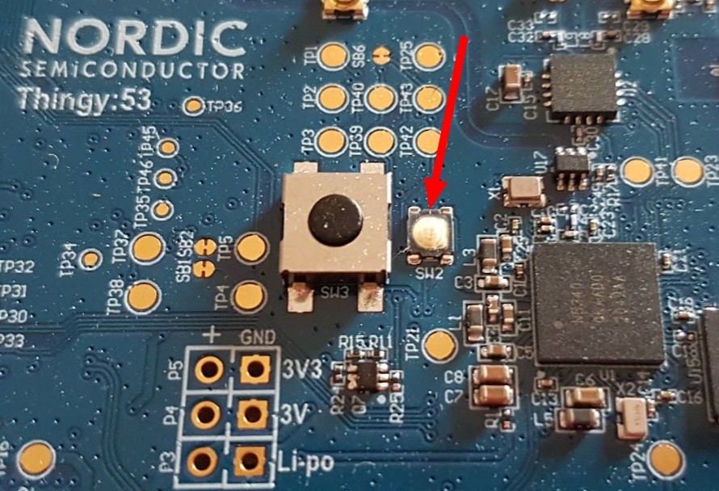

# Edge Impulse firmware for Nordic Semiconductor Thingy:53

[Edge Impulse](https://www.edgeimpulse.com) enables developers to create the next generation of intelligent device solutions with embedded Machine Learning. This repository contains the Edge Impulse firmware for the Nordic Semiconductor Thingy:53 development board that includes a subset of the available sensors, for all of the currently supported sensors see [src/sensors](https://github.com/edgeimpulse/firmware-nordic-thingy53/tree/main/src/sensors). This firmware supports all Edge Impulse features, including ingestion, remote management, and inferencing. Direct communication with the device is performed over a mobile application, but the user can execute all functions via AT command over a USB interface. By including specific build configuration this firmware can be enabled to run with Nordic compatible WiFi external board **nRF7002eb**.

## Building the device firmware (locally)

1. Install the [nRF Connect SDK](https://docs.nordicsemi.com/bundle/ncs-2.4.0/page/nrf/getting_started/installing.html) in a *separate* folder from this repository (e.g. `~/repos/ncs`).

2. Clone this repository:

    ```bash
    $ git clone https://github.com/edgeimpulse/firmware-nordic-thingy53
    ```

3. Build the application:

    ```bash
    #  Thingy:53 build command
    $ west build -b thingy53_nrf5340_cpuapp

    # Thingy:53 with nRF7002eb (WiFi) builf command
    $ west build -b thingy53_nrf5340_cpuapp -- -DSHIELD=nrf7002eb 
    ```

## Building the device firmware (Docker)

1. Clone this repository:

    ```bash
    $ git clone https://github.com/edgeimpulse/firmware-nordic-thingy53
    ```

2. Build the Docker container:

    ```bash
    $ docker build -t edge-impulse-nordic .
    ```

3. Build the application:

    ```bash
    #  Thingy:53 build command
    $ docker run --rm -v $PWD:/app edge-impulse-nordic west build -b thingy53_nrf5340_cpuapp

    # Thingy:53 with nRF7002eb (WiFi) builf command
    $ docker run --rm -v $PWD:/app edge-impulse-nordic west build -b thingy53_nrf5340_cpuapp -- -DSHIELD=nrf7002eb 
    ```

## Flashing

### Over JLink

1. Connect the JLink to the Thingy:53 as described [in this guide](https://docs.nordicsemi.com/bundle/ncs-latest/page/nrf/device_guides/working_with_nrf/nrf53/thingy53_gs.html#updating_through_external_debug_probe); if not previously done, erase the chip with:

    ```bash
    $ nrfjprog --recover
    ```

2. Flash the chip, both application core and networking core, with the command:

    ```bash
    $ west flash
    ```

### Over Serial DFU using `mcumgr` CLi tool

1. Connect USB-C to the Thingy:53. Open the enclosure, press the small button (`SW2`) on top of the device and turn the power switch on.

    

2. After the device is on, release the button. The device is now in bootloader mode. For flashing the new firmware, use commands:

    ```
    mcumgr -t 60 --conntype serial --connstring=/dev/ttyACM0 image list
    mcumgr -t 60 --conntype serial --connstring=/dev/ttyACM0 image upload app_update.bin
    ```

### Over Serial DFU using nRF Connect Desktop

Follow the steps from [this guide](https://docs.nordicsemi.com/bundle/ncs-latest/page/nrf/device_guides/working_with_nrf/nrf53/thingy53_gs.html#updating_through_usb). Instead of precompiled firmware, use the file `build/zephyr/app_signed.hex`.

### Over BLE DFU

#### Use mobile app (Android/iOS)

Use [nRF Connect for Android](https://play.google.com/store/apps/details?id=no.nordicsemi.android.mcp) or [nRF Connect for iOS](https://apps.apple.com/pl/app/nrf-connect-for-mobile/id1054362403) and `build/zephyr/dfu_application.zip`. After connecting to the device, click on the DFU icon and select the file. When the DFU process is done, the device will boot with the new image.

#### Use `mcumgr`

1. Install [mcumgr](https://docs.zephyrproject.org/latest/guides/device_mgmt/mcumgr.html)
2. Upload the firmware (adjust the path to `app_update.bin` and `hci` interface number if you have a few of them)

    ```bash
    mcumgr --conntype ble --hci 0 --connstring peer_name='EdgeImpulse' image upload app_update.bin
    ```

3. Check if the firmware has been uploaded correctly and get the hash of new firmware

    ```bash
    mcumgr --conntype ble --hci 0 --connstring peer_name='EdgeImpulse' image list
    ```

    The output should be similar to the one below; the new image is in slot 1.

    ```
    Images:
    image=0 slot=0
        version: 0.9.9
        bootable: true
        flags: active confirmed
        hash: 67f6f87f3f639217140f9e8073cb28f214499d7f646cb774276496108326a7ba
    image=0 slot=1
        version: 0.9.1
        bootable: true
        flags:
        hash: c218220606d3ecef26dc46ffd7c112e700d08837335516c40ae12f6a86aa7ab2
    Split status: N/A (0)
    ```

4. Test the image and swap the images

    ```
    mcumgr --conntype ble --hci 0 --connstring peer_name='EdgeImpulse' image test <HASH_OF_THE_IMAGE>
    ```

5. Reset the device (may take up to 10-20 seconds)

    ```
    mcumgr --conntype ble --hci 0 --connstring peer_name='EdgeImpulse' reset
    ```
