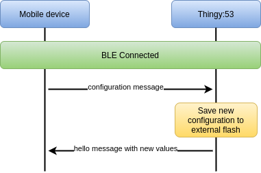

# Edge Impulse Thingy:53 BLE spec
This specification implementes the Bluetooth LE communication protocol for Thingy:53.

## Services

 * **NUS service** (UUID to be changed to EI custom one) - communication with the device
 * **SMP Service** - Service responsible for running Device
  Firmware Updates (DFU)

| Name         | Base UUID                            | Description                                                                |
| ------------ | ------------------------------------ | -------------------------------------------------------------------------- |
| NUS service  | 6E400001-B5A3-F393-E0A9-E50E24DCCA9E | communication with the device UUID                                         |
| SMP Service  | 8D53DC1D-1DB7-4CD3-868B-8A527460AA84 | TThis module is responsible for running Device Firmware Updates on Thingy. |


## Advertising

The device advertises for active and for passive scan with two different strings.

**Passive scan data:**

* Name: `EdgeImpulse`.
* Manufacturer Specific Data.

| Byte  | Status      | Type        | Description                                        |
| ----- | ----------- | ----------- | -------------------------------------------------- |
| [0]   | implemented | COMPANY_ID  | Bluetooth SIG to member companie - Nordic Semi ASA |
| [1-6] | implemented | MAC_ADDRESS | BLE MAC address of the device                      |

**Active scan response data:**

* NUS UUID Value

## NUS Communication protocol

### On connection


After the connection between Mobile device and Thingy:53 has been etablished the "hello" message will be sent to the Mobile device:
```json
 {
    "type": "ws",
    "direction": "tx",
    "address": "wss://studio.edgeimpulse.com",
    "message": {
        "hello": {
            "version": 3,
            "apiKey": "ei_12345dSFDQwq9842934832yu93284y249283y46",
            "deviceId": "01:23:45:67:89:AA",
            "deviceType": "NRF5340_DK",
            "connection": "ip",
            "sensors": [{
                "name": "Accelerometer",
                "maxSampleLengthS": 60000,
                "frequencies": [ 62.5, 100 ]
            }, {
                "name": "Microphone",
                "maxSampleLengthS": 4000,
                "frequencies": [ 16000 ]
            }],
            "supportsSnapshotStreaming": false
        }
    }
}
```
* Hello message is sent without new lines, as one string, **with newline as terminating character**. 
* If device API Key is not written in the external memmory it will return an empty string in the hello message
* If the authentication is correct Mobile device will return message to the Thingy:53
```json
{
    "type": "ws",
    "direction": "rx",
    "address": "wss://studio.edgeimpulse.com",
    "message": {
        "hello": true
    }
}
```
and if not succesfull the Thingy:53 will receive nohing

### Configuration message


Mobile device can send th Thingy:53 configuration message for setting up new API Key and address:
```json
{
    "type": "configure",
    "message": {
        "apiKey": "ei_12345dSFDQwq9842934832yu93284y249283y46",
        "address": "wss://studio.edgeimpulse.com",
    }
}
```
* Configurtion message is sent without new lines, as one string, **with newline as terminating character**. 
* New configuration is written into the external flash
* After receiving correct configuration message device sends hello message with new paramteres